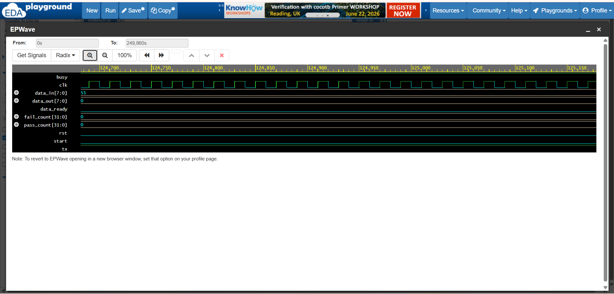
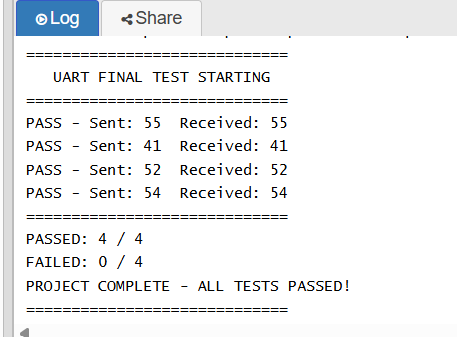

# UART Implementation in Verilog

## Overview
UART (Universal Asynchronous Receiver Transmitter) communication 
protocol implemented in Verilog. Simulated using Icarus Verilog 
on EDA Playground.

## What is UART?
UART is a serial communication protocol that transmits data
one bit at a time. It uses a start bit, 8 data bits, and a
stop bit to send each byte of data.

## Modules
- baud_rate_gen.v — generates a tick pulse every 5208 clock
  cycles for 9600 baud rate at 50MHz clock
- uart_tx.v — transmits 8-bit data serially using FSM
  with states IDLE, START_BIT, DATA_BITS, STOP_BIT
- uart_rx.v — receives serial data and reconstructs 8-bit
  byte using FSM with centre sampling technique
- uart_top.v — connects TX and RX modules together for
  full loopback verification

  ## FSM States
Both TX and RX use a 4-state Finite State Machine:
IDLE → START_BIT → DATA_BITS → STOP_BIT → IDLE

## Tools Used
- EDA Playground (Icarus Verilog 12.0)
- EPWave — waveform viewer

## Key Concepts
- Baud rate: 9600
- Clock frequency: 50 MHz
- Clocks per bit: 5208
- Data format: 8 data bits, 1 start bit, 1 stop bit

## Test Results
PASS - Sent: 55  Received: 55  (U)
PASS - Sent: 41  Received: 41  (A)
PASS - Sent: 52  Received: 52  (R)
PASS - Sent: 54  Received: 54  (T)

PASSED: 4 / 4
PROJECT COMPLETE - ALL TESTS PASSED!

## Status
✅ Project Complete
- Baud rate generator working
- UART TX module with FSM working
- UART RX module with FSM working
- Full loopback test passed
- Final testbench 4/4 passed

## Waveform

## Simulation Output

## How to Run
1. Go to edaplayground.com
2. Create new playground
3. Select Icarus Verilog 12.0
4. Paste uart_top.v in design.sv
5. Paste tb_uart_final.v in testbench.sv
6. Click Run

## Author
Bhoomi Varshney
ECE Student — Chandigarh University
